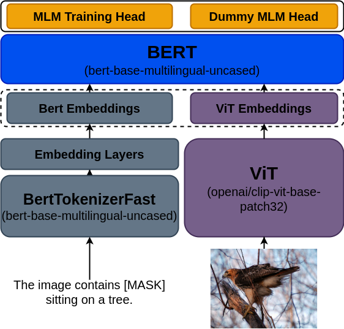

<p align="center">

</p>

# Multilingual Visual Question Answering

Authors: **Gunjan Chhablani**, **Bhavitvya Malik**

GitHub Repository for Multilingual-VQA task created during HuggingFace JAX/Flax community week. Multilingual VQA addresses the challenge of visual question answering in a multilingual setting. Here, we fuse CLIP Vision transformer into BERT and perform pre-training and fine-tuning on translated versions of Conceptual-12M and VQAv2 datasets.

- Our models are present in the `models` directory. We have combined ViT+BERT and CLIP Vision+BERT in the model repository. 
- Our training scripts are:
  - `run_image_text_mlm.py` for pre-training.
  - `run_image_text_classification.py` for fine-tuning.
The shell scripts contain the hyperparameters. Our best performing scripts are:
  - `run.sh` for pre-training.
  - `run_sequence_60k.sh` for fine-tuning.

## Usage:
- Install the `requirements.txt` file in your environment.
- To run a training script, just use your command line:
```sh
./run_sequence_60k.sh
```

## Table of Contents
- [Introduction and Motivation](#introduction-and-motivation)
  - [Novel Contributions](#novel-contributions)
- [Methodology](#methodology)
  - [Pre-training](#pre-training)
    - MLM Dataset
    - MLM Model
    - MLM Training Logs
  - [Finetuning](#finetuning)
    - VQA Dataset
    - VQA Model
    - VQA Training Logs
- [Challenges and Technical Difficulties](#challenges-and-technical-difficulties)
- [Limitations and Bias](#limitations-and-bias)
  - [Limitations](#limitations)
  - [Bias](#bias)
- [Conclusion, Future Work, and Social Impact](#conclusion-future-work-and-social-impact)
  - [Conclusion](#conclusion)
  - [Future Work](#future-work)
  - [Social Impact](#social-impact)
- [References](#references)
  - [Papers](#papers)
  - [Useful Links](#useful-links)
- [Checkpoints](#checkpoints)
  - [Other Checkpoints](#other-checkpoints)
- [Acknowledgements](#acknowledgements)


## Introduction and Motivation
**News**: Two days back, a paper using CLIP-Vision and BERT has been posted on arXiv! The paper uses LXMERT objectives and achieves 80% on the English VQAv2 dataset. It would be interesting to see how it performs on our multilingual dataset. Check it out here: https://arxiv.org/pdf/2107.06383.pdf

Visual Question Answering (VQA) is a task where we expect the AI to answer a question about a given image. VQA has been an active area of research for the past 4-5 years, with most datasets using natural images found online. Two examples of such datasets are: [VQAv2](https://visualqa.org/challenge.html), [GQA](https://cs.stanford.edu/people/dorarad/gqa/about.html). VQA is a particularly interesting multi-modal machine learning challenge because it has several interesting applications across several domains including healthcare chatbots, interactive-agents, etc. **However, most VQA challenges or datasets deal with English-only captions and questions.**

In addition, even recent approaches that have been proposed for VQA generally are obscure due to the fact that CNN-based object detectors are relatively difficult to use and more complex for feature extraction.

For example, a FasterRCNN approach uses the following steps:
- the image features are given out by a FPN (Feature Pyramid Net) over a ResNet backbone, and
- then a RPN (Regision Proposal Network) layer detects proposals in those features, and
- then the ROI (Region of Interest) heads get the box proposals in the original image, and
- then the boxes are selected using a NMS (Non-max suppression),
- and then the features for selected boxes are used as visual features.

A **major advantage that comes from using transformers is their simplicity and their accessibility** - thanks to HuggingFace, ViT and Transformers. For ViT models, for example, all one needs to do is pass the normalized images to the transformer.

While building a low-resource non-English VQA approach has several benefits of its own, a multilingual VQA task is interesting because it will help create a generic model that works well across several languages. And then, it can be fine-tuned in low-resource settings to leverage pre-training improvements. With the aim of democratizing such a challenging yet interesting task, in this project, we focus on Mutilingual Visual Question Answering (MVQA). Our intention here is to provide a Proof-of-Concept with our simple CLIP-Vision-BERT baseline which leverages a multilingual checkpoint with pre-trained image encoders. Our model currently supports for four languages - English, French, German and Spanish.

We follow the two-staged training approach, our pre-training task being text-only Masked Language Modeling (MLM). Our pre-training dataset comes from Conceptual-12M dataset where we use mBART-50 for translation. Our fine-tuning dataset is taken from the VQAv2 dataset and its translation is done using MarianMT models. Our checkpoints achieve a validation accuracy of 0.69 on our MLM task, while our fine-tuned model is able to achieve a validation accuracy of 0.49 on our multilingual VQAv2 validation set. With better captions, hyperparameter-tuning, and further training, we expect to see higher performance.

### Novel Contributions
Our novel contributions include:

- A [multilingual variant of the Conceptual-12M dataset](https://huggingface.co/datasets/flax-community/conceptual-12m-mbart-50-multilingual) containing 2.5M image-text pairs each in four languages - English, French, German and Spanish, translated using mBART-50 model.
- [Multilingual variants of the VQAv2 train and validation sets](https://huggingface.co/datasets/flax-community/multilingual-vqa) containing four times the original data in English, French, German and Spanish, translated using Marian models.
- [A fusion of CLIP Vision Transformer and BERT model](https://github.com/gchhablani/multilingual-vqa/tree/main/models/flax_clip_vision_bert) where BERT embeddings are concatenated with visual embeddings at the very beginning and passed through BERT self-attention layers. This is based on the VisualBERT model.
- A [pre-trained checkpooint](https://huggingface.co/flax-community/clip-vision-bert-cc12m-70k) on our multilingual Conceptual-12M variant with 67.85% validation accuracy.
- A [fine-tuned checkpoint](https://huggingface.co/flax-community/clip-vision-bert-vqa-ft-6k) on our multilingual variant of the VQAv2 dataset with 49.76% validation accuracy.

## Methodology
### Pre-training
We follow an approach similar to [VisualBERT](https://arxiv.org/abs/1908.03557). Instead of using a FasterRCNN to get image features, we use a CLIP Vision (ViT transformer) encoder. The pre-training task is text-only MLM (Masked Language Modeling). We mask only the text tokens and try to predict the masked tokens. The VisualBERT authors also use a sentence-image matching task where two captions are matched against an image, but we skip this for the sake of simplicity.


<p align="center">

</p>
  
**MLM Dataset**
The dataset we use for pre-training is a cleaned version of Conceptual 12M. The dataset is downloaded and then broken images are removed which gives us about 10M images. Then we use the MBart50 mbart-large-50-one-to-many-mmt checkpoint to translate the dataset into four different languages - English, French, German, and Spanish, keeping 2.5 million examples of each language. This dataset is used for MLM pre-training.

**MLM Model**
The model is shown in the figure below. The Dummy MLM Head is actually combined with the MLM head but it never contributes to the MLM loss, hence the name (the predictions on these tokens are ignored). We create a custom model in Flax which integerates the CLIP Vision model inside BERT embeddings. We also use custom configs and modules in order to accomodate for these changes, and allow loading from BERT and CLIP Vision checkpoints. The image is fed to the CLIP Vision encoder and the text is fed to the word-embedding layers of BERT model. We use the bert-base-multilingual-uncased and openai/clip-vit-base-patch32 checkpoints for BERT and CLIP Vision models, respectively. All our code and hyperparameters are available in our python scripts/shell scripts.

**MLM Training Logs**
Please visit this link for TensorBoard logs: https://huggingface.co/flax-community/multilingual-vqa-pt-ckpts/tensorboard

### Finetuning
  
**VQA Dataset**
For fine-tuning, we use the [VQA 2.0](https://visualqa.org/) dataset - particularly, the train and validation sets. We translate all the questions into the four languages specified above using language-specific MarianMT models. This is because MarianMT models return better labels and are faster, hence, are better for fine-tuning. We get 4x the number of examples in each subset.

**VQA Model**
We use the SequenceClassification model as reference to create our own sequence classification model. In this, a classification layer is attached on top of the pre-trained BERT model in order to performance multi-class classification. 3129 answer labels are chosen, as is the convention for the English VQA task, which can be found [here](https://github.com/gchhablani/multilingual-vqa/blob/main/answer_mapping.json). These are the same labels used in fine-tuning of the VisualBERT models. The outputs shown here have been translated using the [mtranslate](https://github.com/mouuff/mtranslate) Google Translate API library. Then we use various pre-trained checkpoints and train the sequence classification model for various steps.

**VQA Training Logs**
Please visit this link to see our TensorBoard logs: https://huggingface.co/flax-community/multilingual-vqa-pt-60k-ft/tensorboard

### Challenges and Technical Difficulties
We faced challenges at every step of the way, despite having some example scripts and models ready by the 🤗 team in Flax.

- The dataset we used - Conceptual 12M took 2-3 days to translate using MBart (since we didn't have Marian at the time). The major bottleneck was implementing the translation efficiently. We tried using `mtranslate` first but it turned out to be too slow, even with multiprocessing.

- The translations with deep learning models aren't as "perfect" as translation APIs like Google and Yandex. This could lead to poor performance.

- We prepared the model and config classes for our model from scratch, basing it on `CLIP Vision` and `BERT `implementations in Flax. The ViT embeddings should be used inside the BERT embeddings class, which was the major challenge here.

- We prepared a training script for image-text text-only MLM and sequence classification, which we based on hybrid clip, masked LM and the text classification examples.

- We were only able to get around 1.5 days of training time on TPUs due to above mentioned challenges. We were unable to perform hyperparameter tuning. Our loss curves on the pre-training show that the training hasn't converged, and we could see further improvement in the MLM accuracy.

- The VQA dataset, despite having many examples, and after translating into 4x the number of examples, is small and the model overfits. In order to address this, we need more multilingual data, and lighter models, which are both a major challenge right now.

## Limitations and Bias
### Limitations
Our best fine-tuned model only achieves 0.49 accuracy on the multilingual validation data that we create. This could be because of not-so-great quality translations, sub-optimal hyperparameters and lack of ample training.

Because of this, a proper limitations and bias analysis is difficult because it could be a result of the subpar performance.

We experiment a lot in our `Examples` section to see where the model fails and where it works well:

- The model can answer **color questions** very well. It does get confused where a human would also would get confused, however.
- The **counting** works decently when the objects are large, of the same type, and not too many in number. But,
    - It fails to learn the difference between a Giraffe and Zebra, for example, in a given image, and when it is asked about the count of zebras and giraffes, it answers 0 and 2. Check out `Counting Questions` subsection in `Examples`.

    - If there are too many objects present, and it is asked about something very specific, it fails to perform well and gives large numbers as a result.

    - When the objects are too small in the image, it is unable to focus well in the image and when asked about count, it returns 0.
- The model performs okay with **size and shape questions**. We have seen many examples of this and one is present in `Examples` section.

- Yes/No questions: The performance is similar to that as in color questions. The model is able to work very well on obvious questions but when asked about slightly challenging questions (for example asking whether eyes of the giraffe are closed or not in a far-up image), it doesn't work as well. A human would also get confused while answering such questions so that is expected.

- It doesn't work on negatives very well. For example, given an image of a happy person, asking "Is the person happy?" leads to "Yes" but "Is the person not happy?" also leads to yes. This problem has been observed in BERT model as well and needs to be addressed.

- It is almost always consistent with multilinguality and leads to the same answer. We try with counting questions, color questions, and a miscellaneous question.

- It works very well on questions where objects/places are the answers in all four languages.

### Biases

Our model, like any other model, is prone to some biases present in the pre-trained models (CLIP-ViT and mBART). Some bias can also leak in from the mBART-50 and Marian models we used to translate the datasets. Not to mention, the datasets themselves will have some bias.

Because we haven't addressed these issues yet, the model can contain many sexist, racist, stereotypical biases which may be hateful, harmful or ignorant. 

Since Conceptual-12M has all names and pronouns removed from the dataset. That could have led to reduction of bias to some extend. We checked for gender and racial/color bias in our examples. We haven't reached a conclusion on how biases our VQA model is, as the answers are not consistently biases in different languages or the different ways questions are asked. It heavily depends on the performance as well. For example, giving an image of a woman and asking "Is this a man?" might lead to "Yes" because of the poor performance itself.

We intend to fix these issues with cleaner/better, varied sources of training data. Only then we can mitigate such biases which affect the users and society.
  
## Conclusion, Future Work, and Social Impact
 
### Conclusion
In this project, we presented Proof-of-Concept with our CLIP Vision + BERT model baseline which leverages a multilingual checkpoint with pre-trained image encoders in four languages - **English, French, German, and Spanish**. Our model performs very well considering the amount of training time we were able to get and achieves 0.49 eval accuracy on our multilingual VQAv2 dataset.

### Future Work
We hope to improve this project in the future by using:
- Superior translation model: Translation has a very huge impact on how the end model would perform. Better translators (for e.g. Google Translate API) and language specific seq2seq models for translation are able to generate better data, both for high-resource and low-resource languages.
- Checking translation quality: Inspecting quality of translated data is as important as the translation model itself. For this we'll either require native speakers to manually inspect a sample of translated data or devise some unsupervised translation quality metrics for the same.
- More data: Currently we are using only 2.5M images of Conceptual 12M for image captioning. We plan to include other datasets like Conceptual Captions 3M, subset of YFCC100M dataset etc.
- Low resource languages: With better translation tools we also wish to train our model in low resource languages which would further democratize the image captioning solution and help people realise the potential of language systems.
- Better training: We can improve our training by playing with hyperparameters, optimizers, and learnign rate schedulers which we didn't get the time for during the sprint.
- More models: Currently we stick to CLIP-ViT and mBART-50. However, there are many multilingual models which can be used in place of mBART-50. ViT transformer, officially, has many many checkpoints which can be combined. We can use any other auto-regressive model insted of seq2seq trained on multilingual data in order to create a diverse set of models specifically for this task.
- Better deployability: We intend to make several different versions of the model in order to help make it available for mobile-phone deployments.
- More domains: We want to go beyond the domain of natural images, and cover medical, artistic, and satellite images which have several downstream applications and such a model would be very much in demand.
  
### Social Impact
Our approach has a significant social impact, considering the sheer number of use-cases for this model and dataset.
- Translating the data using the existing MT models is a huge plus since multilingual data is scarce.
- The model we created is easy to use and easy-to-train (hassle-free).
- A multilingual model which answers questions based on a image has many usecases:
    - Healthcare Chatbots
    - Personal Assistants
    - Devices for visually-impaired people
and so on.

With more and better training, we should be able to produce models that work across several languages and help solve several real-life problems for the community.


## References
### Papers
```
@inproceedings{wolf-etal-2020-transformers,
    title = "Transformers: State-of-the-Art Natural Language Processing",
    author = "Thomas Wolf and Lysandre Debut and Victor Sanh and Julien Chaumond and Clement Delangue and Anthony Moi and Pierric Cistac and Tim Rault and Rémi Louf and Morgan Funtowicz and Joe Davison and Sam Shleifer and Patrick von Platen and Clara Ma and Yacine Jernite and Julien Plu and Canwen Xu and Teven Le Scao and Sylvain Gugger and Mariama Drame and Quentin Lhoest and Alexander M. Rush",
    booktitle = "Proceedings of the 2020 Conference on Empirical Methods in Natural Language Processing: System Demonstrations",
    month = oct,
    year = "2020",
    address = "Online",
    publisher = "Association for Computational Linguistics",
    url = "https://www.aclweb.org/anthology/2020.emnlp-demos.6",
    pages = "38--45"
}
```
```
@inproceedings{changpinyo2021cc12m,
  title = {{Conceptual 12M}: Pushing Web-Scale Image-Text Pre-Training To Recognize Long-Tail Visual Concepts},
  author = {Changpinyo, Soravit and Sharma, Piyush and Ding, Nan and Soricut, Radu},
  booktitle = {CVPR},
  year = {2021},
}
```
```
@InProceedings{mariannmt,
  title     = {Marian: Fast Neural Machine Translation in {C++}},
  author    = {Junczys-Dowmunt, Marcin and Grundkiewicz, Roman and
               Dwojak, Tomasz and Hoang, Hieu and Heafield, Kenneth and
               Neckermann, Tom and Seide, Frank and Germann, Ulrich and
               Fikri Aji, Alham and Bogoychev, Nikolay and
               Martins, Andr\'{e} F. T. and Birch, Alexandra},
  booktitle = {Proceedings of ACL 2018, System Demonstrations},
  pages     = {116--121},
  publisher = {Association for Computational Linguistics},
  year      = {2018},
  month     = {July},
  address   = {Melbourne, Australia},
  url       = {http://www.aclweb.org/anthology/P18-4020}
}
```
```
@misc{agrawal2016vqa,
      title={VQA: Visual Question Answering}, 
      author={Aishwarya Agrawal and Jiasen Lu and Stanislaw Antol and Margaret Mitchell and C. Lawrence Zitnick and Dhruv Batra and Devi Parikh},
      year={2016},
      eprint={1505.00468},
      archivePrefix={arXiv},
      primaryClass={cs.CL}
}
```
```
@misc{li2019visualbert,
      title={VisualBERT: A Simple and Performant Baseline for Vision and Language}, 
      author={Liunian Harold Li and Mark Yatskar and Da Yin and Cho-Jui Hsieh and Kai-Wei Chang},
      year={2019},
      eprint={1908.03557},
      archivePrefix={arXiv},
      primaryClass={cs.CV}
}
```
```
@misc{vaswani2017attention,
      title={Attention Is All You Need}, 
      author={Ashish Vaswani and Noam Shazeer and Niki Parmar and Jakob Uszkoreit and Llion Jones and Aidan N. Gomez and Lukasz Kaiser and Illia Polosukhin},
      year={2017},
      eprint={1706.03762},
      archivePrefix={arXiv},
      primaryClass={cs.CL}
}
```
```
@misc{radford2021learning,
      title={Learning Transferable Visual Models From Natural Language Supervision},
      author={Alec Radford and Jong Wook Kim and Chris Hallacy and Aditya Ramesh and Gabriel Goh and Sandhini Agarwal and Girish Sastry and Amanda Askell and Pamela Mishkin and Jack Clark and Gretchen Krueger and Ilya Sutskever},
      year={2021},
      eprint={2103.00020},
      archivePrefix={arXiv},
      primaryClass={cs.CV}
}
```
### Useful Links
- [Conceptual 12M Dataset](https://github.com/google-research-datasets/conceptual-12m)

- [VQA v2 Dataset](https://visualqa.org/challenge.html)

- [Hybrid CLIP Example](https://github.com/huggingface/transformers/blob/master/src/transformers/models/clip/modeling_flax_clip.py)

- [VisualBERT Modeling File](https://github.com/huggingface/transformers/blob/master/src/transformers/models/visual_bert/modeling_visual_bert.py)

- [BERT Modeling File](https://github.com/huggingface/transformers/blob/master/src/transformers/models/bert/modeling_flax_bert.py)

- [CLIP Modeling File](https://github.com/huggingface/transformers/blob/master/src/transformers/models/clip/modeling_flax_clip.py)

- [Summarization Training Script](https://github.com/huggingface/transformers/blob/master/examples/flax/summarization/run_summarization_flax.py)

- [MLM Training Script](https://github.com/huggingface/transformers/blob/2df63282e010ac518683252d8ddba21e58d2faf3/examples/flax/language-modeling/run_mlm_flax.py)

## Checkpoints
- Pre-trained checkpoint at 60k steps: [clip-vision-bert-cc12m-60k](https://huggingface.co/flax-community/clip-vision-bert-cc12m-60k)
- Pre-trained checkpoint at 70k steps: [clip-vision-bert-cc12m-70k](https://huggingface.co/flax-community/clip-vision-bert-cc12m-70k)
- Fine-tuned checkpoint at 6k steps on 60k pre-trained checkpoint: [clip-vision-bert-vqa-ft-6k](https://huggingface.co/flax-community/clip-vision-bert-vqa-ft-6k)

### Other Checkpoints
- All pre-trained checkpoints: [multilingual-vqa](https://huggingface.co/flax-community/multilingual-vqa)
- Fine-tuned checkpoints on 45k pre-trained checkpoint: [multilingual-vqa-pt-45k-ft](https://huggingface.co/flax-community/multilingual-vqa-pt-45k-ft)
- Fine-tuned checkpoints on 45k pre-trained checkpoint with AdaFactor (others use AdamW): [multilingual-vqa-pt-45k-ft-adf](https://huggingface.co/flax-community/multilingual-vqa-pt-45k-ft-adf)
- Fine-tuned checkpoints on 60k pre-trained checkpoint: [multilingual-vqa-pt-60k-ft](https://huggingface.co/flax-community/multilingual-vqa-pt-60k-ft)
- Fine-tuned checkpoints on 70k pre-trained checkpoint: [multilingual-vqa-pt-60k-ft](https://huggingface.co/flax-community/multilingual-vqa-pt-70k-ft)
- From scratch (without MLM pre-training) model: [multilingual-vqa-ft](https://huggingface.co/flax-community/multilingual-vqa-ft)

## Acknowledgements
We thank [Nilakshan Kunananthaseelan](https://huggingface.co/knilakshan20) for helping us whenever he could get a chance. We also thank [Abheesht Sharma](https://huggingface.co/abheesht) for helping in the discussions in the initial phases. [Luke Melas](https://github.com/lukemelas) helped us get the CC-12M data on our TPU-VMs and we are very grateful to him.

This project would not be possible without the help of [Patrick](https://huggingface.co/patrickvonplaten) and [Suraj](https://huggingface.co/valhalla) who met with us and helped review our approach and guided us throughout the project.

Lastly, we thank the Google Team for helping answer our queries on the Slack channel, and for providing us TPU-VMs.
